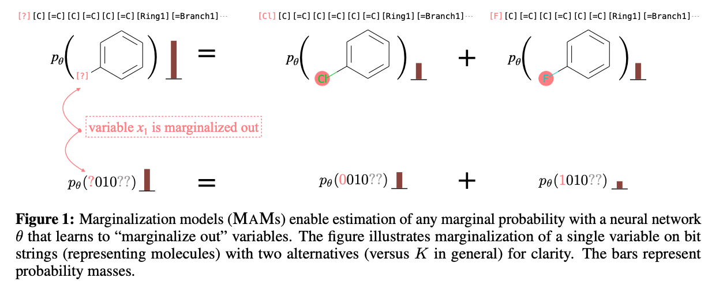

# Generative Marginalization Models

This repository contains the official PyTorch implementaion for the paper: **Generative Marginalization Models** [[paper link](https://arxiv.org/abs/2310.12920)], by [Sulin Liu](https://liusulin.github.io/), [Peter J. Ramadge](https://ece.princeton.edu/people/peter-j-ramadge), and [Ryan P. Adams](https://www.cs.princeton.edu/~rpa/).

We introduce **marginalization models** (MaMs), a new family of generative models for high-dimensional discrete data. 

## What are Marginalization Models?

MaMs directly model the marginal distribution $p_\theta(x_s)$ for any subset of variables $x_s$ in $x$. 

The learned marginals should satisfy the "*marginalization self-consistency*": 

$$p_\theta(x_s) = \sum\nolimits_{x_{s^c}} p_\theta(x_s, x_{s^c})$$

where $x_{s^c}$ are the variables that are "marginalized out". See *Figure 1*  below for a concrete example for the binary case.



To learn self-consistent marginals, we propose scalable training objectives that minimize the error of the following one-step self-consistency constraints imposed on marginals and conditionals over all possible orderings:

$$
\begin{gather}
  p_\theta(x_{\sigma (< d)}) p_\theta(x_{\sigma (d)} | x_{\sigma (< d)}) = p_\theta(x_{\sigma (\leq d)}), \\
  \quad  \text{for any ordering  }  \sigma, \text{any  }x \in [1:K]^D, d \in [1:D]. \nonumber
\end{gather}
$$

## Why Marginalization Models?
Marginals are order-agnostic, hence MaMs allow any-order generation. 
Any-order autoregressive models [[1](https://arxiv.org/abs/1310.1757),[2](https://arxiv.org/abs/1502.03509),[3](https://arxiv.org/abs/2110.02037)] also allow any-order marginal inference via factorizing $p(x)$ into univariate conditionals.
Compared to AO-ARMs, direct modeling of marginals have two main advantages: 
1. **significant speeding up inference** in test time for any marginal, with orders of magnitude.
$\mathcal{O}(1)$ v.s. $\mathcal{O}(D)$ with autoregressive models.
2. enabling **scalable training** of any-order generative models on **high-dimensional problems** under **energy-based training**, a common setting in physical sciences or applications with a target reward function.
In contrast, training ARMs requires $\mathcal{O}(D)$ evaluation (a sequence of conditionals) to get the log-likelihood of one data point required for energy-based training.

## Installation
```shell
git clone https://github.com/PrincetonLIPS/MaM.git
cd MaM
# optional virtual env
python -m venv env 
source env/bin/activate
python -m pip install -r requirements.txt
```

## Maximum likelihood estimation problems

To train MaMs for *maximum likelihood estimation*, we fit the marginals by **maximizing** the expected **log-likelihood** over data distribution while **enforcing** the **marginalization self-consistency**.

$$
\begin{align*}
  \max_{\theta, \phi} \quad & \mathbb E_{x \sim p_{\text{data}}} \log p_\theta(x) 
 \\
  \text{s.t.} \quad & p_\theta(x_{\sigma (< d)}) p_\phi(x_{\sigma (d)} | x_{\sigma (< d)}) = p_\theta(x_{\sigma (\leq d)}), \quad \forall \sigma \in S_D, x \in \{1,\cdots,K\}^D, d \in [1:D].
\end{align*}
$$

For the most efficient training, the marginals can be learned in two-steps:

**1. Fit the conditionals $\phi$**: maximize the log-likelihood following the objective for training AO-ARMs.

$$
\max_\phi \quad \mathbb E_{x \sim p_{\text{data}}} \mathbb E_{\sigma \sim \mathcal{U}(S_D)}   
\sum\nolimits_{d=1}^D \log p_\phi \left( x_{\sigma(d)} | x_{\sigma(< d)} \right)
$$

```shell
cd ao_arm
python image_main.py # MNIST-Binary dataset
python text_main.py # text8 language modeling
python mol_main.py load_full=True # MOSES molecule string dataset
```

**2. Fit the marginals $\theta$**: minimize the errors of self-consistency in Eq. (1).

$$
  \min_{\theta} \quad \mathbb E_{x \sim q(x)} \mathbb E_{\sigma \sim \mathcal{U}(S_D)} \mathbb E_{d \sim \mathcal{U}(1,\cdots,D)} \left( \log p_\theta(x_{\sigma (< d)}) + \log p_\phi(x_{\sigma (d)} | x_{\sigma (< d)}) - \log p_\theta(x_{\sigma (\leq d)}) \right)^2.
$$

```shell
cd mam
python image_main.py load_pretrain=True # MNIST-Binary
python text_main.py load_pretrain=True # text8
python mol_main.py load_pretrain=True # MOSES molecule string
```
Coming soon: code and model checkpoints for more image datasets including CIFAR-10 and Imagenet-32.

## Energy-based training problems
In this setting, we do not have data samples from the distribution of interest. Instead, we have access to evaluate the unnormalized (log) probability mass function $f$ , usually in the form of reward function or energy function, that are defined by humans or by physical systems to specify how likely a sample is. The goal is to match the learned distribution $p_\theta(x)$ to the given desired probability $f(x)$ so that we can sample from $f(x)$ efficiently with a generative model. It is commonly encountered in modeling the thermodynamic equilibrium ensemble of physical systems [[4](https://www.science.org/doi/10.1126/science.aaw1147)] and goal-driven generative design problems with reward functions [[5](https://arxiv.org/abs/2106.04399)].

Training of ARM are expensive because of the need to calculate $p_\theta(x)$ with a sequence of conditionals. MaMs circumvent this by training directly with the marginals while enforcing the marginalization self-consistency.

$$
\begin{align*}
  \min_{\theta, \phi} \quad  D_\text{KL}\big( p_{\theta} (x) \parallel p (x) \big) + \lambda \,\mathbb E_{x \sim q(x)} \mathbb E_{\sigma} \mathbb E_{d} \left( \log p_\theta (x_{\sigma \left(< d\right)} ) + \log p_\phi (x_{\sigma \left(d\right)} | x_{\sigma \left(< d\right)}) - \log p_\theta (x_{\sigma \left(\leq d\right)} ) \right)^2.
\end{align*}
$$

```shell 
cd mam
# ising model energy-based training
python ising_eb_main.py
# molecule property energy-based training with a given reward function
python mol_property_eb_main.py 
```

## Citation

Please check the paper for technical details and experimental results. Please consider citing our work if you find it helpful:

```
@article{liu2023mam,
  title={Generative Marginalization Models},
  author={Liu, Sulin and Ramadge, Peter J and Adams, Ryan P},
  journal={arXiv preprint arXiv:2310.12920},
  year={2023}
}
```

### Acknowledgement
The code for training any-order conditionals of autoregressive models (in `ao_arm/`) are adapted from https://github.com/AndyShih12/mac, using the original any-order masking strategy proposed for training AO-ARMs without the `[mask]` token in the output.
